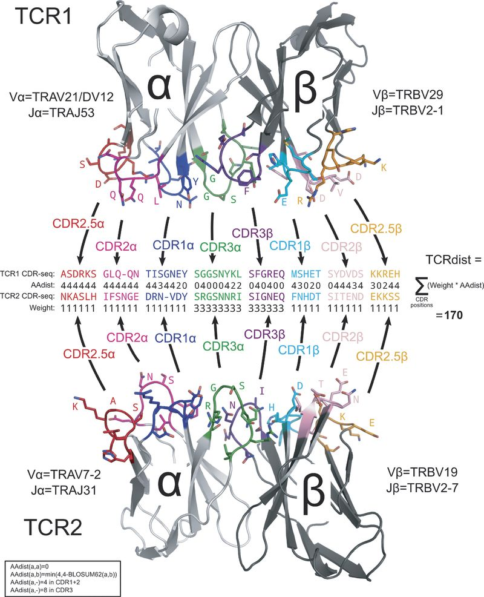

tcrdist3
========

July 2020

**tcrdist3 provides flexible distance measures for comparing T cell receptors across complementarity determining regions (CDRs)**

.. code-block:: none

   pip install tcrdist3

`tcrdist3 <https://github.com/kmayerb/tcrdist3>`_ is a python API-enabled toolkit for analyzing T-cell receptor repertoires. Some of the functionality and code is adapted from the original tcr-dist package which was released with the publication of Dash et al. Nature (2017). The manuscript
(`doi:10.1038/nature22383 <https://www.nature.com/articles/nature22383>`_). tcrdist3 is a python API-enabled toolkit for analyzing T-cell receptor repertoires. Some of the functionality and code is adapted from the original tcr-dist package which was released with the publication of Dash et al. Nature (2017) doi:10.1038/nature22383. 
This package contains a new API for computing distance measures as well as new features.

.. toctree::
   :caption: Getting started
   :maxdepth: 1

   inputs
   tcrdistances

**Schematic overview of the TCRdist calculation.**

Extended Data `Figure 3 <https://www.nature.com/articles/nature22383/figures/7>`_
is particularly illustrative.

"Each TCR is mapped to the amino acid sequences of the loops within the
receptor that are known to provide contacts to the pMHC (commonly referred
to as CDR1, CDR2, and CDR3, as well as an additional variable loop between
CDR2 and CDR3). The distance between two TCRs is computed by comparing these
concatenated CDR sequences using a similarity-weighted Hamming distance,
with a gap penalty introduced to capture variation in length and a higher
weight given to the CDR3 sequence in recognition of its disproportionate
role in epitope specificity (see Methods and Extended Data Fig. 3)."

