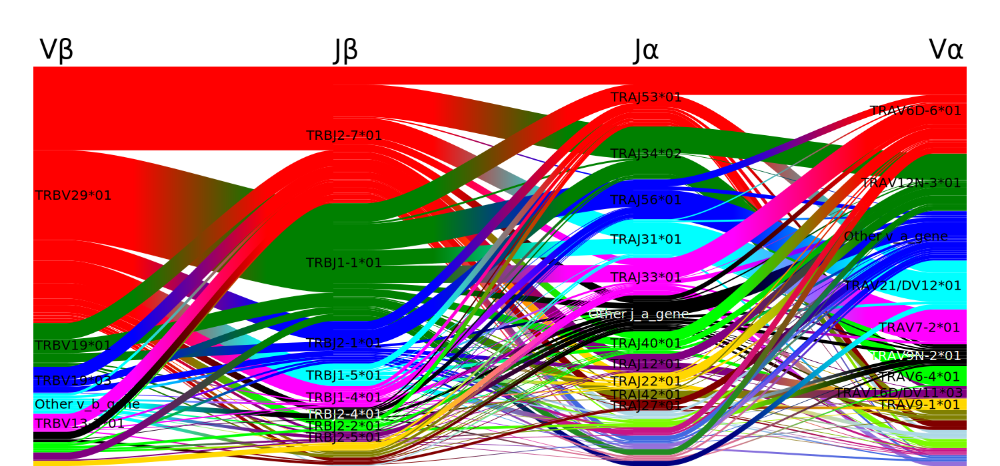
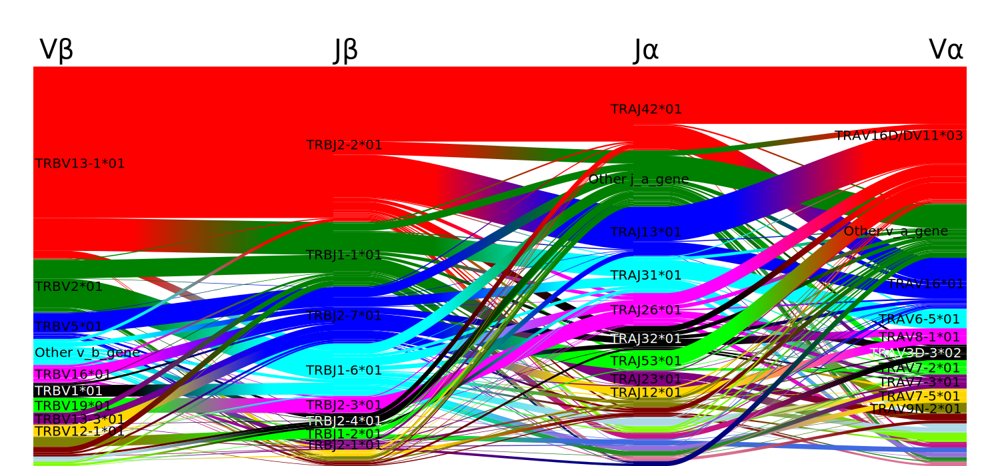
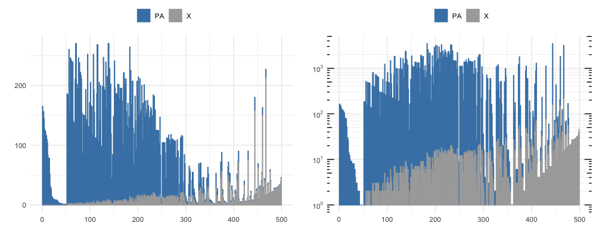
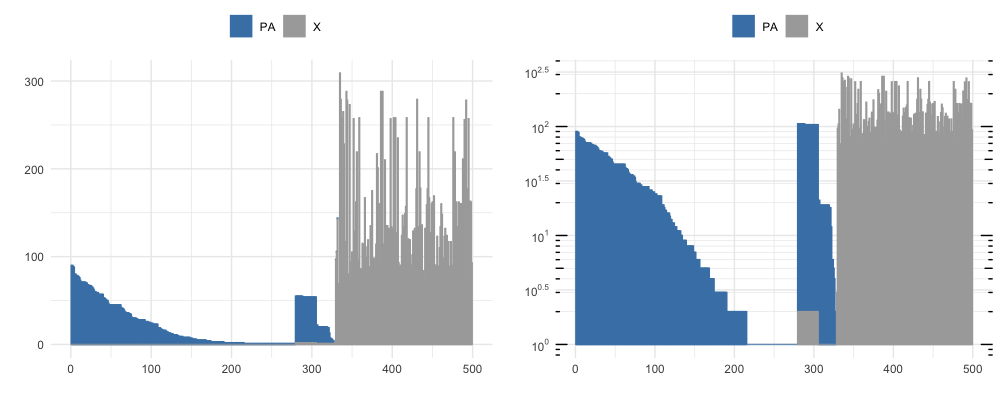

.. tip::
   
   NOTE: tcrdist3 is in a pre-release phase and these docs are currently being drafted. 
   All code snippets are actual working unit and integration tests, but some 
   described features may not be available until the 1.0.0 release (Expected August 31st, 2020)

tcrdist3
========

`tcrdist3 <https://github.com/kmayerb/tcrdist3>`_ is an open-source python package that enables a broad array of T cell receptor sequence analyses.

In addition to the docstrings found throughout the code, we provide an example in a minimal TCR analysis workflow. A gallery of runnable examples demonstrates the suite of features and more complext analyses.

Installation
------------

.. code-block:: none

   pip install git+https://github.com/kmayerb/tcrdist3.git@0.1.6

Docker Container
----------------

.. code-block:: none

   docker pull quay.io/kmayerb/tcrdist3:0.1.6

If you need more details, checkout out the page on the tcrdist3 :ref:`docker` container.

Brief background
----------------

A human alpha/beta T cell repertoire is huge, comprised of an estimated 10^11 to 10^13 total T cells, with the process of V(D)J recombination capable of generating as many as 10^15 to 10^20 unique receptor sequences. With the wide adoption of high-throughput Adaptive Immune Receptor Repertoire sequencing (AIRR-seq) and single-cell sequencing technologies, immunologists are witnessing an explosion in the availability of TCR repertoire data.

TCR functional diversity is concentrated in complementarity defining regions (CDRs) that contact antigen-presenting molecules and enable receptor docking and antigenic specificity. Although software tools exist for TCR repertoire analysis we have developed a modern Python package that improves upon a biochemically aware TCR distance metric that can effectively reduce the dimensionality of repertoire data, enable statistical analyses that efficiently handle the scale of and molecular diversity in AIRR-seq datasets. Tcrdist3 is designed as an interactive set of functional operations that can be interfaced with existing tools and used to construct flexible hypothesis-driven analysis pipelines within batch computing frameworks.

Loading a TCR Dataset
---------------------

Loading a TCR dataset from most standard formats, including AIRR, MIXCR and Adaptive, and preparing it for analysis with tcrdist3 is simple. Tcrdist3 operates with a `pandas.DataFrame`, which can be created from CSV/TSV and many other tabular formats. Once the DataFrame is loaded its a matter of renaming columns to match tcrdist or telling tcrdist which columns to use.

[example of loading from a `.csv file <https://raw.githubusercontent.com/kmayerb/tcrdist2/API2/tcrdist/test_files_compact/dash.csv>`_ ].

.. literalinclude:: ../tcrdist/tests/test_introduction_1.py
    :linenos:
    :lines: 6-50
    :dedent: 4
    :language: python

For analyses that require the sequences of the CDRs encoded by the V genes, 
these sequences can be inferred from gene/allele names based on IMGT nomenclature 
(the nomenclature used by Adaptive Biotechnology is also supported as shown in 
an example on :ref:`loading_adaptive_biotechnology`).

Gene Level Analyses
-------------------

Loading a TCR dataset will immediately enable gene-level analyses of repertoires, 
for example Sankey plots of V/D/J gene frequency or statistical tests for differential 
gene enrichment in two or more conditions:

.. literalinclude:: ../tcrdist/tests/test_introduction_3.py
    :linenos:
    :lines: 16-28
    :dedent: 4
    :language: python

PA and NP gene usage diagrams. Click to enlarge.

|pic1| |pic2|

See the example gallery (:ref:`visualizing`) for more examples of how to produce these diagrams.

.. literalinclude:: ../tcrdist/tests/test_introduction_3.py
    :linenos:
    :lines: 30-50
    :dedent: 4
    :language: python

+-----+---------+------+----------+------------+-------+-------+-------+-------+----------+----------+----------+----------+----------+----------+-----------+----------+
|     | xcol    | xval | ycol     | yval       | X+Y+  | X+Y-  | X-Y+  | X-Y-  | X_marg   | Y_marg   | X|Y+     | X|Y-     | Y|X+     | Y|X-     | OR        | pvalue   |
+-----+---------+------+----------+------------+-------+-------+-------+-------+----------+----------+----------+----------+----------+----------+-----------+----------+
| 0   | epitope | NP   | j_b_gene | TRBJ1-6*01 | 48.0  | 255.0 | 2.0   | 963.0 | 0.238959 | 0.039432 | 0.960000 | 0.209360 | 0.158416 | 0.002073 | 90.635294 | 0.000001 |
+-----+---------+------+----------+------------+-------+-------+-------+-------+----------+----------+----------+----------+----------+----------+-----------+----------+
| 1   | epitope | NP   | j_b_gene | TRBJ2-7*01 | 52.0  | 251.0 | 146.0 | 819.0 | 0.238959 | 0.156151 | 0.262626 | 0.234579 | 0.171617 | 0.151295 | 1.162146  | 0.414406 |
+-----+---------+------+----------+------------+-------+-------+-------+-------+----------+----------+----------+----------+----------+----------+-----------+----------+
| ..  | ...     | ...  | ...      | ...        | ...   | ...   | ...   | ...   | ...      | ...      | ...      | ...      | ...      | ...      | ...       | ...      |
+-----+---------+------+----------+------------+-------+-------+-------+-------+----------+----------+----------+----------+----------+----------+-----------+----------+
| 103 | epitope | PB1  | v_b_gene | TRBV3*01   | 10.0  | 631.0 | 3.0   | 624.0 | 0.505521 | 0.010252 | 0.769231 | 0.502789 | 0.015601 | 0.004785 | 3.296355  | 0.090888 |
+-----+---------+------+----------+------------+-------+-------+-------+-------+----------+----------+----------+----------+----------+----------+-----------+----------+
| 104 | epitope | PB1  | v_b_gene | TRBV30*01  | 5.0   | 636.0 | 0.0   | 627.0 | 0.505521 | 0.003943 | 1.000000 | 0.503563 | 0.007800 | 0.000000 | inf       | 0.062083 |
+-----+---------+------+----------+------------+-------+-------+-------+-------+----------+----------+----------+----------+----------+----------+-----------+----------+

TCR Distancing
--------------

Central to TCR repertoire analysis is the choice of a distance measure that relates unique TCRs to one another, based on the assumption that TCRs sharing a high degree of sequence similarity tend to recognize the same or similar MHC-bound peptides (pMHCs). In the absence of TCR distance-based sequence clustering, one is forced to treat each TCR clonotype as a unique biological entity. The major methodological drawback of considering each clonotype in isolation is s that it is rare to observe identical clonotypes in multiple samples from the same individual and even rarer across multiple individuals, making it difficult to discover novel biomarkers or understand generalized underpinnings of TCR:pMHC specificity. By relating pairs of TCRs with a sequence-based distance, the analyst can vastly reduce the effective diversity of a TCR repertoire and enable the application of distance-based statistical learning methods. 

This concept of a TCR distance motivate our group's initial analyses in Dash et al. (2017) and is well appreciated by the growing community of experts in immune repertoire analysis (Glanville et al. 2017, Madi et al. 2017, Pogorelyy and Shugay 2019, Huang et al. 2020). Tcrdist3 builds on our previous efforts and offers a unique, flexible, and efficient approach for computing distances among TCRs.

By initializing the TCRRep object with data, using default arguments, you have already computed distances among all pairs of unique TCRs. By default, TCRRep computes the distance published in Dash et al., which is based on amino-acid similarity in each of the CDR loops, with greater weight on the CDR3. 

.. literalinclude:: ../tcrdist/tests/test_introduction_4.py
    :linenos:
    :lines: 6-50
    :dedent: 4
    :language: python

A unique feature of tcrdist3 is that all of the parameters of the distance metric can be adjusted (e.g. alpha-chain only, weights on CDR loops, etc.) or completely new user-defined metrics can be provided to calculate pairwise distances. The package comes with a distance based on Needleman-Wunsch global sequence alignment and a BLOSUM62 similarity matrix, as well as the Levenshtein/edit distance, which is employed by other TCR analysis packages such as TCRNET/VDJtools, ALICE, and GLIPH2.
[example of a beta-only edit distance]

See the example gallery (:ref:`tcrdistances`) for many examples of the flexibility provided for computing TCR distances.

Specificity Neighborhoods
-------------------------

With pairwise distances defined, the next step is to group similar TCRs into neighborhoods (i.e., clusters of biochemically similar TCRs). This can be achieved with any number of distance-based clustering methods (basic clustering in python can be performed with sklearn.clustering [https://scikit-learn.org/stable/modules/clustering.html]). We have focused our initial efforts on nearest-neighbor (NN) and hierarchical clustering. The NN method forms a neighborhood around a TCR based on a pre-specified inclusion radius or a fixed number of neighborhood members; we suggest forming a neighborhood around every unique TCR using a relatively conservative radius that includes TCRs with <1-2 aa substitutions in the CDR3, such that all TCRs within the neighborhood likely share antigenic specificity [will be nice at some point to show a graph of how TCR distance relates to CDR3 hamming distance on average for distances from one sequence in the "head" of a single epitope, as a rough guide].

Fixed Radius Neighborhoods
++++++++++++++++++++++++++

.. literalinclude:: ../tcrdist/tests/test_introduction_5.py
    :linenos:
    :lines: 6-50
    :dedent: 4
    :language: python

.. tip::
   The full sorted output table has a lot of information, but a takeaway from the first row 
   can be gathered from a subset of the columns shown below. Notice that **clone 1011** neighbors 93 unique clonetypes (`K_neighbors`), repressenting 165 sequences (`ct_0`) that all share PA-epitope specificity and 0 ('ct_2') that are not PA-specific.

+------+-------------+----------------+------+---------------+------+------+-------+-------------+---------+------------+
|      | K_neighbors | val_0          | ct_0 | val_2         | ct_2 | RR   | OR    | pvalue      | FWERp   | FDRq       |
+------+-------------+----------------+------+---------------+------+------+-------+-------------+---------+------------+
| 1011 | 93          | ('PA', 'MEM+') | 165  | ('X', 'MEM+') | 0    | 7.12 | inf   | 2.16566-06  | 0.00308 | 7.262e-06  |
+------+-------------+----------------+------+---------------+------+------+-------+-------------+---------+------------+
| 1050 | 82          | ('PA', 'MEM+') | 156  | ('X', 'MEM+') | 0    | 7.00 | inf   | 1.92270e-06 | 0.00288 | 7.262e-06  |
+------+-------------+----------------+------+---------------+------+------+-------+-------------+---------+------------+
| 1075 | 82          | ('PA', 'MEM+') | 156  | ('X', 'MEM+') | 0    | 7.00 | inf   | 1.92270e-06 | 0.00288 | 7.262e-06  |
+------+-------------+----------------+------+---------------+------+------+-------+-------------+---------+------------+
| 500  | 76          | ('PA', 'MEM+') | 144  | ('X', 'MEM+') | 0    | 6.85 | inf   | 1.30396e-06 | 0.00224 | 7.262e-06  |
+------+-------------+----------------+------+---------------+------+------+-------+-------------+---------+------------+
| 60   | 70          | ('PA', 'MEM+') | 127  | ('X', 'MEM+') | 0    | 6.64 | inf   | 1.69754e-06 | 0.00269 | 7.262e-06  |
+------+-------------+----------------+------+---------------+------+------+-------+-------------+---------+------------+
| 71   | 76          | ('PA', 'MEM+') | 124  | ('X', 'MEM+') | 0    | 6.61 | inf   | 1.16703e-06 | 0.00204 | 7.262e-06  |
+------+-------------+----------------+------+---------------+------+------+-------+-------------+---------+------------+

By vizualizing the first 500 rows of the DataFrame output by `neighborhood_diff` at different thresshold radi, 
we see the number of similar clones clustering to each unique clone and the proportion of neighboring clones that are
also PA-epitope specific (shown in blue), at a knn_radius = 150 (top) and at a knn_radius = 75 (bottom). 

.. tip::
   This dataset alone is not sufficient to estimate a threshold tcrdistance threshold likely to 
   enrich for clustesr of epitope-specific TCRs. This is because the non-PA TCRs in this demo dataset, are 
   also under strong selection to recognize another epitope. A more illustrative example would use a larger set 
   of background sequences that might be expected in non-presorted repertoire. We will show 
   later on how an improved analysis can be done with larger background datasets. 

Hierarchical Neighborhoods
++++++++++++++++++++++++++

Alternatively, hierarchical clustering provides neighborhoods with a range of TCR diversity from pairs of similar TCRs near the leaves of the tree to larger neighborhoods near the root. While its unlikely that the larger nodes of a clustered repertoire will represent a single epitope specificity, evaluating a range of neighborhood sizes provides a more unbiased approach. The hierdiff module includes a plotting function for producing a dendrogram that uses the color of each neighborhood/node of the tree to represent a categorical meta-data variable such as the experimental condition under which the TCRs were observed; the SVG output enables embedding in a Jupyter notebook or html page and can provide a useful way to interactively explore the clusters.

.. literalinclude:: ../tcrdist/tests/test_introduction_6.py
    :linenos:
    :lines: 6-50
    :dedent: 4
    :language: python

See `Interactive PA-Epitope Hierdiff Tree <_static/hierdiff_example.html>`_.

.. tip:: 
   The purpose of defining many, potentially overlapping and redundant neighborhoods, is to provide a comprehensive set of features that could potentially be associated with an experimental condition or phenotype of interest. The ultimate goal may be to filter out the most interesting TCRs and their neighborhoods for future investigation.

Neighborhood Enrichment
-----------------------

Like all statistical analyses, TCR analysis benefits from a properly designed experimental design with a testable prospective hypothesis. For instance, an experiment might seek to identify vaccine-induced TCRs in one individual with samples collected and sequenced before and after vaccination; the hypothesis would be that the vaccine induced one or more expansions among T cells recognizing a vaccine epitope. The functions tcrdist.stats.hier_diff and neighborhood_diff enable testing of this hypothesis by testing each neighborhood for enrichment or depletion of TCRs associated with a specific condition or variable; after multiplicity adjustment clusters with significant enrichment are good candidates for further investigation.

[example] 

One may also be interested in a population-level question about whether there is a neighborhood of TCRs that are consistently or "publicly" induced by a vaccine; such a TCR might be a candidate biomarker for vaccine protection. The rep_diff functions can also accommodate basic experimental designs involving multiple subjects and categorical covariates. For more complicated experiments the count tables generated by nn_tally/hier_tally can also be exported for use in more sophisticated modeling frameworks (e.g. linear regression, mixed effects, etc.)

CDR3 Motif Analysis
-------------------

Enrichment is one of many ways to identify a potentially interesting TCRs. The generation probability, Pgen, defined by Walczyk and colleagues is another way of filtering TCRs and TCR neighborhoods that are more frequent than expected based on their probability of being produced through recombination in 
development. 

Saving
------

Save your TCRrep object using `dill <https://pypi.org/project/dill/>`_.

.. code-block:: python
   
   import dill
   import pandas as pd
   from tcrdist.repertoire import TCRrep
   
   df = pd.read_csv("dash.csv")
   tr = TCRrep(cell_df = df,
               organism = 'mouse',
               chains = ['alpha','beta'],
               db_file = 'alphabeta_gammadelta_db.tsv')    
   
   dill.dump(tr, open("yourfile.dill", mode='wb'))
   tr_reloaded = dill.load(open("yourfile.dill", mode='rb'))

.. tip:: 
   For larger datasets, you may wish to first remove unwanted large attributes 
   that will contribute to the overall file size before dill pickling. Moreover, 
   you can achieve additional space saving by converting Numpy ndarray attributes 
   to type `int16`, prior to saving. In the example below, 
   these steps reduce the final filesize from 114 MB to 36 MB. 

.. code-block:: python
   
   import dill
   import pandas as pd
   from tcrdist.repertoire import TCRrep
   
   df = pd.read_csv("dash.csv")
   tr = TCRrep(cell_df = df,
               organism = 'mouse',
               chains = ['alpha','beta'],
               db_file = 'alphabeta_gammadelta_db.tsv')    
   
   """
   Optional: remove CDR specific attributes
   prior to saving
   """
   tr.pw_pmhc_a_aa = None
   tr.pw_cdr3_a_aa = None
   tr.pw_cdr2_a_aa = None
   tr.pw_cdr1_a_aa = None
   tr.pw_pmhc_b_aa = None
   tr.pw_cdr3_b_aa = None
   tr.pw_cdr2_b_aa = None
   tr.pw_cdr1_b_aa = None

   """
   Optional: change numpy datatype to further reduces file sizes
   """
   tr.pw_alpha = tr.pw_alpha.astype('int16')
   tr.pw_alpha = tr.pw_beta.astype('int16')

   dill.dump(tr, open("yourfile.dill", mode='wb'))
   tr_reloaded = dill.load(open("yourfile.dill", mode='rb'))

Bulk Repertoires
----------------

References
----------

Dash, P. et al. Quantifiable predictive features define epitope-specific T cell receptor repertoires. Nature 547, 89–93 (2017)

Glanville, J. et al. Identifying specificity groups in the T cell receptor repertoire. Nature 547, 94–98 (2017)

Madi, A. et al. T cell receptor repertoires of mice and humans are clustered in similarity networks around conserved public CDR3 sequences. Elife 6, (2017)

Pogorelyy, M. V. & Shugay, M. A Framework for Annotation of Antigen Specificities in High-Throughput T-Cell Repertoire Sequencing Studies. Front. Immunol. 10, 2159 (2019)

Pogorelyy, M. V. et al. Detecting T cell receptors involved in immune responses from single repertoire snapshots. PLOS Biology vol. 17 e3000314 (2019)

Huang, H., Wang, C., Rubelt, F., Scriba, T. J. & Davis, M. M. Analyzing the Mycobacterium tuberculosis immune response by T-cell receptor clustering with GLIPH2 and genome-wide antigen screening. Nat. Biotechnol. (2020) doi:10.1038/s41587-020-0505-4

.. toctree::
   :caption: Workflow
   :maxdepth: 1
   
   index
   

.. toctree::
   :caption: Gallery
   :maxdepth: 1

   tcrdistances
   visualizing
   motif_gallery
   influenza_example
  

.. toctree::
   :caption: More Details
   :maxdepth: 1

   adaptive
   bulkdata
   docker
   downloads
   inputs
   pGen
   tree
   
.. toctree::
   :caption: Advanced Usage
   :maxdepth: 1

   simulate

   

