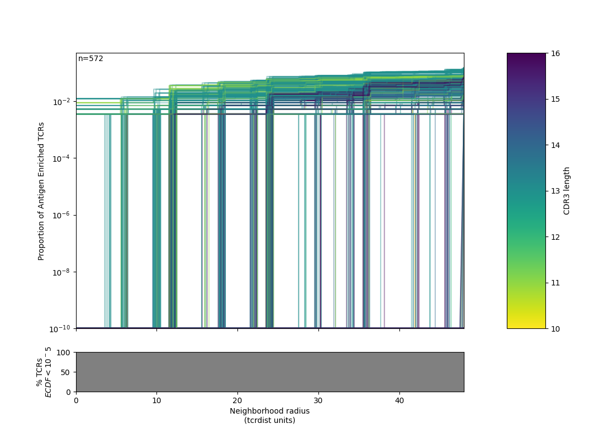
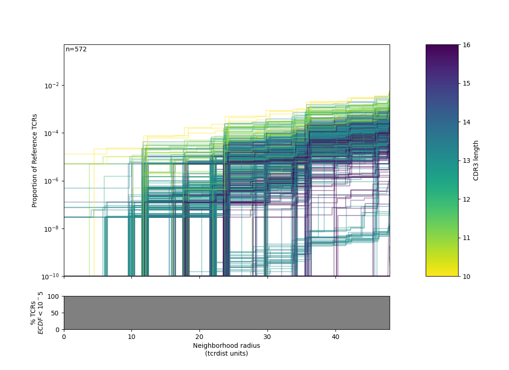

.. _metaclonotypes:

Meta-Clonotypes
===============

The script for meta-clonotype discovery contains a function (``find_metaclonotypes``). It encapsulates a workflow we used for finding meta-clonotypes in antigen-enriched data as
described in 'TCR meta-clonotypes for biomarker discovery with tcrdist3: quantification of public, HLA-restricted TCR biomarkers of SARS-CoV-2 infection'
`bioRxiv 2020 <https://www.biorxiv.org/content/10.1101/2020.12.24.424260v1>`_ .

To ensure you have the necessary background reference files in 
your environment or the tcrdist3 docker container, run the following before getting started:

.. code-block:: bash

	apt-get install unzip
	python3 -c "from tcrsampler.setup_db import install_all_next_gen; install_all_next_gen(dry_run = False)"

Meta-Clonotype Discovery
++++++++++++++++++++++++

.. literalinclude:: ../docs/metaclonotypes.py
    :linenos:
    :language: python

For each run, the function will write the following outputs:

.. code-block:: bash
	
	project_folder/
	├── .centers_bkgd_ctlr_1E5.tsv
	├── .centers_bkgd_ctlr_1E6.tsv
	├── .ecdf_AER_plot.png
	├── .ecdf_BUR_plot.png
	├── .olga100K_brit100K_bkgd.csv
	├── .ranked_centers_bkgd_ctlr_1E5.html
	├── .ranked_centers_bkgd_ctlr_1E5.tsv
	├── .ranked_centers_bkgd_ctlr_1E6.html
	├── .ranked_centers_bkgd_ctlr_1E6.tsv
	└── .rw_beta.npz

|ecdf1| |ecdf2|

One of the outputs is an html report of non-redundant meta-clonotypes `.ranked_centers_bkgd_ctlr_1E6.html <_static/mira_epitope_48_610_YLQPRTFL_YLQPRTFLL_YYVGYLQPRTF.tcrdist3.csv.ranked_centers_bkgd_ctlr_1E6.html>`_.

Meta-Clonotype Tabulation
+++++++++++++++++++++++++

The `.ranked_centers_bkgd_ctlr_1E6.tsv` files produced above can be used to directly search for the presence of meta-clonotypes is bulk data. How do we do this? Before showing how to do this for many files consider doing it for a single bulk repertoire:

In this example:

1. We download a raw ImmunoSEQ file. 
2. Format it for use in tcrdist3.
3. Search it with one of the meta-clonotypes file we made from above.

.. literalinclude:: ../docs/real_bulk_example.py
    :lines: 1-47
    :language: python

The results, which can be saved as .tsv include the following:

* ``cdr3_b_aa`` - meta-clonotype centroid CDR3
* ``v_b_gene``  - meta-clonotype centroid TRBV
* ``j_b_gene``  - meta-clonotype centroid TRBJ
* ``pgen``.     - meta-clonotype centroid TRBV, CDR3 Pgen (Probability of Generation, estimated with OGLA)
* ``radius``    - meta-clonotype maximum TCRdist to find a neighbor
* ``regex``     - pattern of conserved positions learned from the all those sequences with <radius> of the centroid in the antigen enriched dataset.
* ``cdr1_b_aa`` - meta-clonotype centroid CDR1
* ``cdr2_b_aa`` - meta-clonotype centroid CDR2
* ``pmhc_b_aa`` - meta-clonotype centroid CDR2.5
* ``bulk_sum_freq``    - In the bulk sample, sum of frequencies of TCRs within the <radius> of the centroid (* RADIUS)
* ``bulk_sum_counts``  - In the bulk sample, total template TCRs (counts) within the <radius> of the centroid (* RADIUS)
* ``bulk_seqs``        - In the bulk sample, CDR3 seqs of TCRs within the <radius> of the centroid
* ``bulk_v_genes``     - In the bulk sample, TRBVs of TCRs within the <radius> of the centroid
* ``bulk_j_genes``     - In the bulk sample, TRBJs of TCRs within the <radius> of the centroid
* ``bulk_distances``   - In the bulk sample, distances of TCRs from centroid, for those within the <radius> of the centroid
* ``bulk_counts``      - In the bulk sample, individual counts of each TCR within radius of the centroid
* ``bulk_freqs``       - In the bulk sample, individual frequencies of each TCR within radius of the centroid
* ``bulk_regex_match`` - In the bulk sample, boolean for each CDR3 within the <radius> whether it matched the regex motif pattern
* ``bulk_sum_freqs_regex_adj``  - In the bulk sample, sum of frequencies of TCRs within the <radius> of the centroid and matching regex (RADIUS + MOTIF)
* ``bulk_sum_counts_regex_adj`` - In the bulk sample, sum of counts of TCRs within the <radius> of the centroid and matching regex (RADIUS + MOTIF)
* ``bulk_sum_freqs_tcrdist0``   - In the bulk sample, sum of frequencies of TCRs within the <radius> = 0 of the centroid (EXACT)
* ``bulk_sum_counts_tcrdist0``  - In the bulk sample, sum of counts of TCRs within the <radius> = 0 of the centroid (EXACT)

Tabulation Against Many
+++++++++++++++++++++++

Below is a complete example used to tabulate the frequency and counts of 
each meta-clonotype in 694 bulk samples. Note that you have to supply a valid path to the directory where all the bulk files reside in your environment.

.. literalinclude:: ../docs/metaclonotype-tabulation.py
    :linenos:
    :language: python

