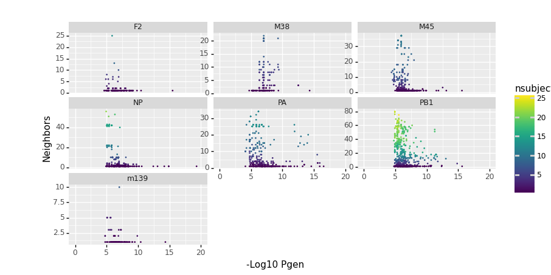

.. _pgen:

Probability of Generation
=========================

Human Example 
-------------

The generation probability, Pgen, defined by Walczyk and colleagues and implemented in Python by Sethna et al. (2019) is another way of filtering TCRs and TCR neighborhoods that are more frequent than expected based on their probability of being produced through recombination in early phases of immune development. 

.. literalinclude:: ../tcrdist/tests/test_pgen_1.py
    :linenos:
    :lines: 6-50
    :dedent: 4
    :language: python

If you want to compute many pgens this example shows how you can use parmap to accelerate the computation 
if you have multiple cores. 

.. literalinclude:: ../tcrdist/tests/longtest_pgen_parallel.py
    :linenos:
    :lines: 46-60
    :dedent: 4
    :language: python

Mouse Example 
-------------

This example shows similar functionality for mouse data. It also 
illustrates how OLGA + tcrdist3 allow one to look for low 
probability of generation TCRs that have lots of biochemically 
similar neighbors, which can be a sign of strong convergent 
selection cause by antigen exposure.

.. literalinclude:: ../tcrdist/tests/test_pgen_mouse.py
    :linenos:
    :lines: 6-140
    :dedent: 4
    :language: python

|pgen_img1| 

References 
----------

Zachary Sethna, Yuval Elhanati, Curtis G Callan, Aleksandra M Walczak, Thierry Mora
`Bioinformatics (2019) <https://doi.org/10.1093/bioinformatics/btz035>`_ 
OLGA: fast computation of generation probabilities of B- and T-cell receptor amino acid sequences and motifs
