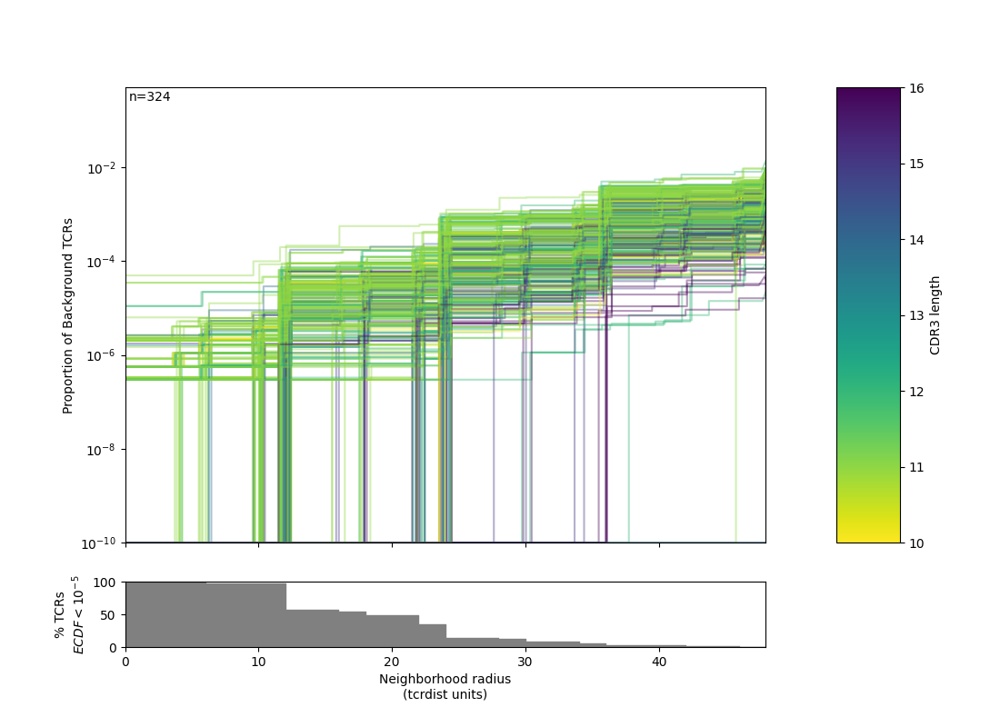
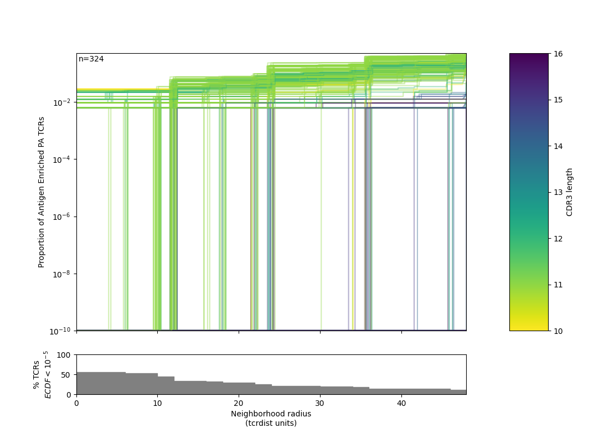

.. _radius:

Radius
======

The utility of a TCR-based biomarker depends on antigen recognition. Therefore, a key constraint on distance-based clustering is the presence of similar TCR sequences that may lack the ability to recognize the target antigen. To be useful, a biochemical neighborhood definition should be wide enough to capture multiple biochemically similar TCRs with shared antigen-recognition, but not excessively broad as to include a high number of sequences found in background repertoires that are antigen-naive. Because the density of neighborhoods around TCRs are heterogeneous, we hypothesize that the optimal radius for grouping may differ according to properties of each TCR. To find an ideal radius we proposed comparing the relative density of a radius-defined target TCR neighborhood in the antigen-enriched repertoire to the density in a radius-defined neighborhood in an unenriched reference repertoire. Radii may be tuned based on how common a given query TCR is within an un-enriched bulk background repertoire. Due to biases in VDJ recombination, some TCRs will naturally have more neighbors. By contrast TCRs with rarer V-J pairings and more randomly inserted nucleotides will naturally have fewer neighbors, absent strong convergent selective pressure. tcrdist3 allows flexible discovery of TCR-specific search radii based on controlling an estimated rate of TCR-neighbor discovery in default or user-supplied control repertoires Inverse probability weighting may be used to more efficiently estimate background TCR discovery rate. 

The following example shows how:

.. literalinclude:: ../tcrdist/tests/test_example_24_centers.py
    :linenos:
    :lines: 6-115
    :dedent: 4
    :language: python

|pic1| |pic2|

See `PA QuasiPublic Meta Clonotypes <_static/quasi_public_clones_PA.html>`_.

Note: another conservative approach is to use a small fixed radius such as 16 
TCRdist units (TDUs), this corresponds with 1-3 amino acid changes between CDR3s, depending on substituted residues. 

