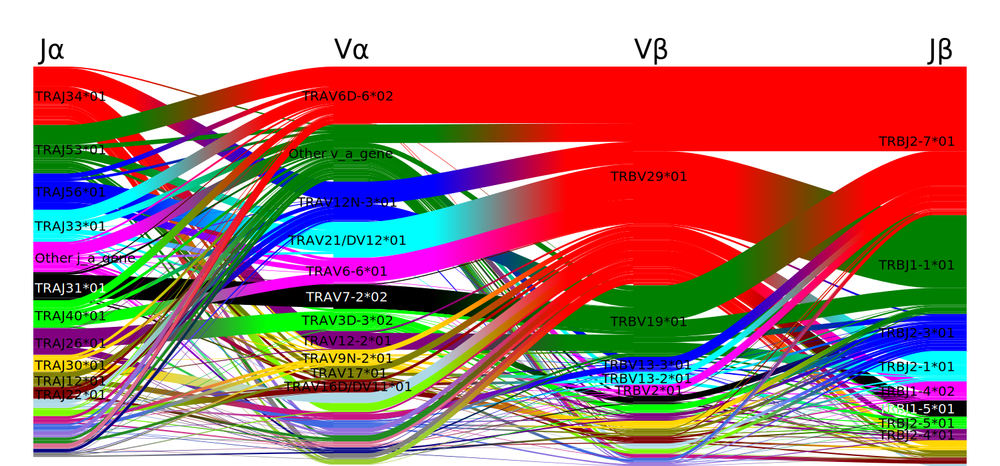
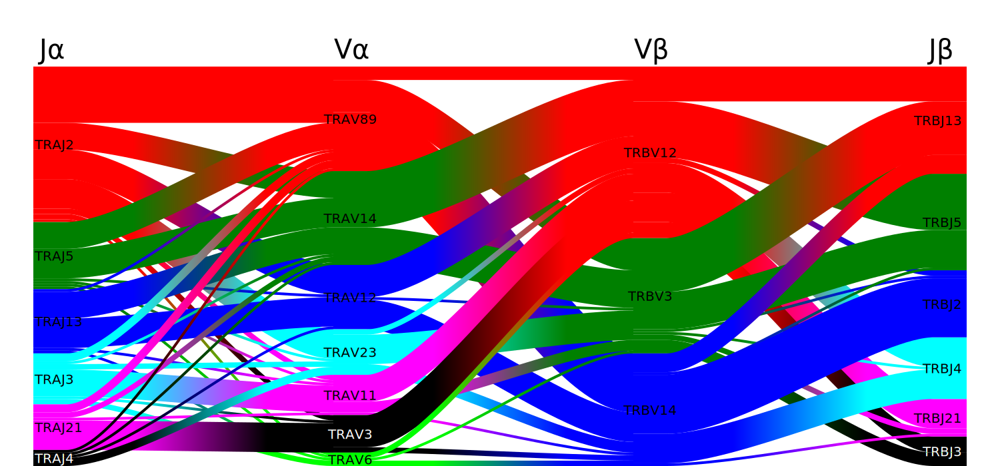
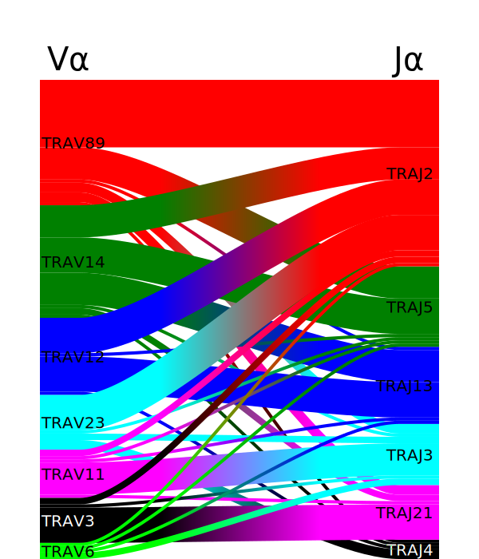

Visualizing
===========

Some of the most popular features of the original tcrdist code were
its beautiful SVG based graphics.
For instance, gene usage plots visualize the frequency
with which different V and J genes are used within a T cell repertoire.
Because some users may wish to make these plots without using the other
feature of tcrdist2, we have built them as stand-alone features.
**That means if you can create a pandas DataFrame you can make a gene-usage plot.**

.. toctree::
   :maxdepth: 2
   :caption: Contents:

plot_pairings
-------------

.. automodule:: tcrdist.gene_pairing_plot

.. autofunction:: plot_pairings

Examples Plotting Gene Usage
----------------------------

A popular feature of tcrdist is the ability to visualize the gene usage
pattern of a T cell repertoire specific for a particular epitope. This
feature has been re-implemented in tcrdist2 and is part of the plotting
module.

To illustrate how tcrdist.plotting.plot_pairings() is based on a data
frame of gene usage we simulate some data.

Notice only a few columns are necessary: (i) one for each gene (ii) and
one specifying the count.

An Example With Simulated Data
~~~~~~~~~~~~~~~~~~~~~~~~~~~~~~

.. code:: python

  import tcrdist as td
  import pandas as pd
  import numpy as np
  import IPython

  np.random.seed(110820)
  n = 50
  df = pd.DataFrame({'v_a_gene':np.random.choice(['TRAV14', 'TRAV12', 'TRAV3',
                                  'TRAV23', 'TRAV11', 'TRAV6', 'TRAV89'], n),
                     'j_a_gene':np.random.choice(['TRAJ4', 'TRAJ2', 'TRAJ3',
                                  'TRAJ5', 'TRAJ21', 'TRAJ13'], n),
                     'v_b_gene':np.random.choice(['TRBV14', 'TRBV12',
                                  'TRBV3'], n),
                     'j_b_gene':np.random.choice(['TRBJ4', 'TRBJ2', 'TRBJ3',
                                  'TRBJ5', 'TRBJ21', 'TRBJ13'], n)})

  df = df.assign(count=1)
  df.loc[:10, 'count'] = 10 # Sim expansion of the genes used in the first 10 rows

  svg = td.plotting.plot_pairings(cell_df = df,
                                  cols = ['j_a_gene', 'v_a_gene',
                                          'v_b_gene', 'j_b_gene'],
                                  count_col='count')
  IPython.display.SVG(data=svg)

The same type of visualization can be made for bulk unpaired
single-chain data, by specifying the cols list as follows. Note the plot
depends on the gene order specified in the ``cols`` argument

.. code:: python

  svg = td.plotting.plot_pairings(cell_df = df,
                                 cols = ['v_a_gene', 'j_a_gene'],
                                 count_col='count')
  IPython.display.SVG(data=svg)

An Example With Real Data
~~~~~~~~~~~~~~~~~~~~~~~~~

The code below produces a figure similar to that in the tcrdist
manuscript, where the dominance of the TRBV29*01 is particularly
evident.

1. Load the data from Dash et al. paper.
2. Use a mapper to convert vdjDB data to tcrdist2 input pd.DataFrame.
3. Subset the data to consider only mouse sequences specific to the ‘PA’
  epitope.

.. code:: python

  import tcrdist as td
  import pandas as pd
  import numpy as np
  import IPython

  pd_df = pd.read_csv("vdjDB_PMID28636592.tsv", sep = "\t")       # 1
  t_df = td.mappers.vdjdb_to_tcrdist2(pd_df = pd_df)              # 2

  organism =  "MusMusculus"                                       # 3
  epitope  =  "PA"

  ind_org   = t_df.organism == organism
  ind_epi   = t_df.epitope  == epitope

  t_df_spec = t_df.loc[(ind_org)&(ind_epi),:]

  svg = td.plotting.plot_pairings(cell_df = t_df_spec,
                                  cols = ['j_a_gene', 'v_a_gene',
                                          'v_b_gene', 'j_b_gene'],
                                  count_col='count',
                                  other_frequency_threshold = 0.01)
  IPython.display.SVG(data=svg)

